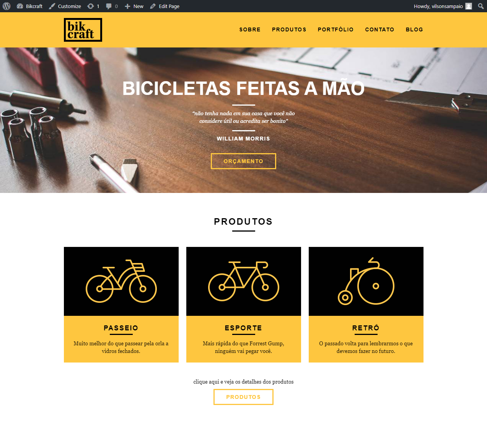
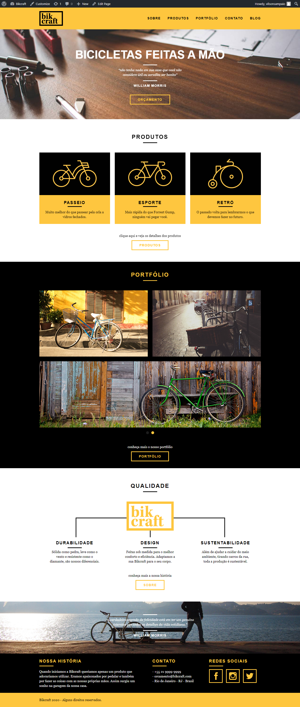
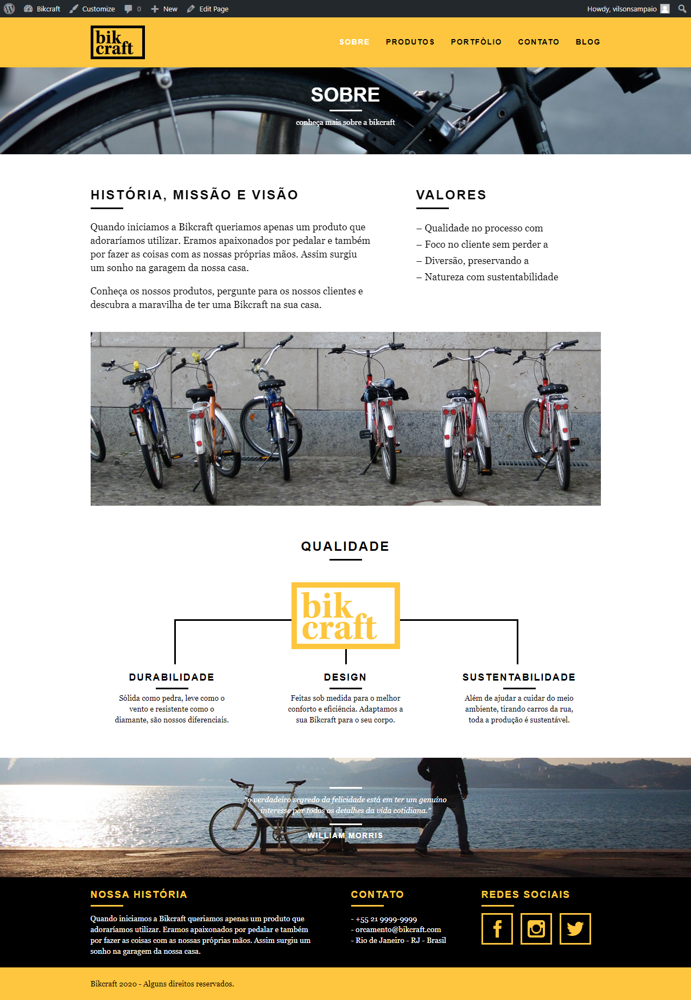
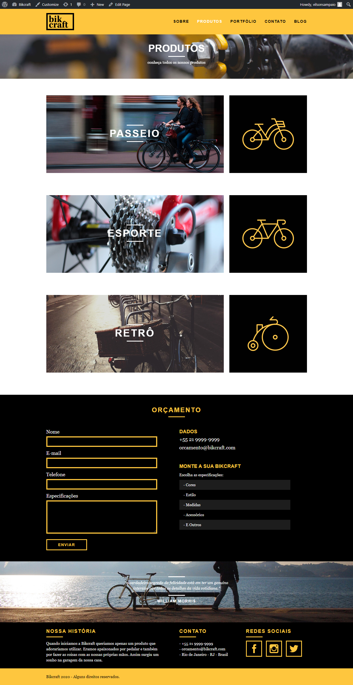
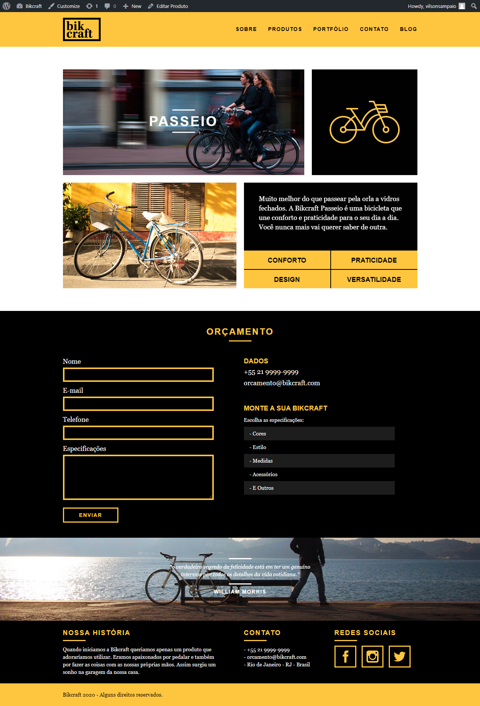
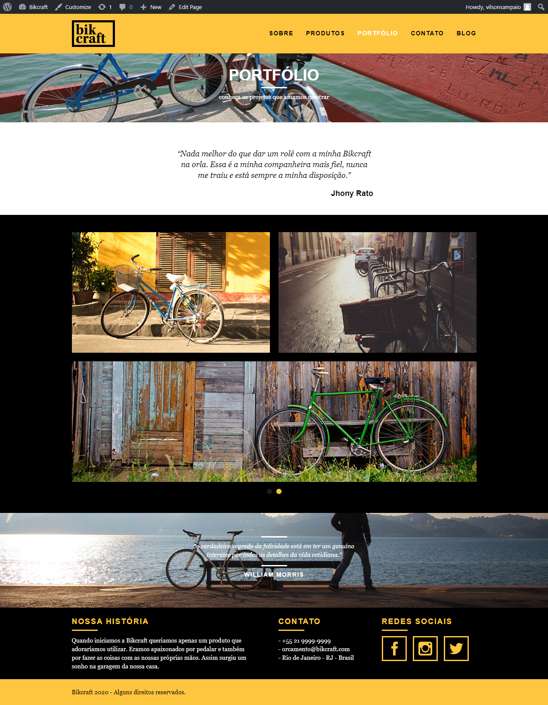
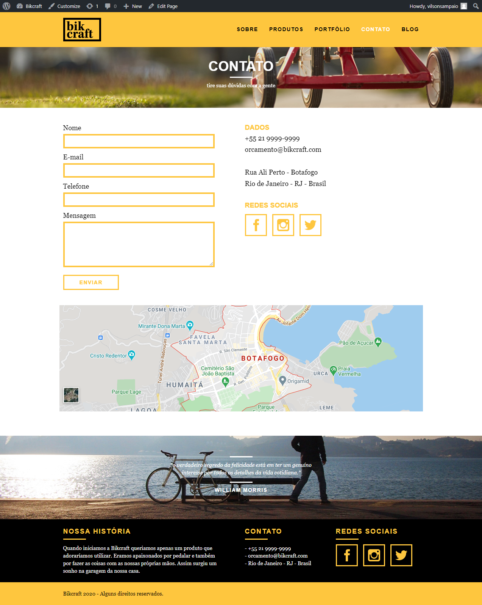
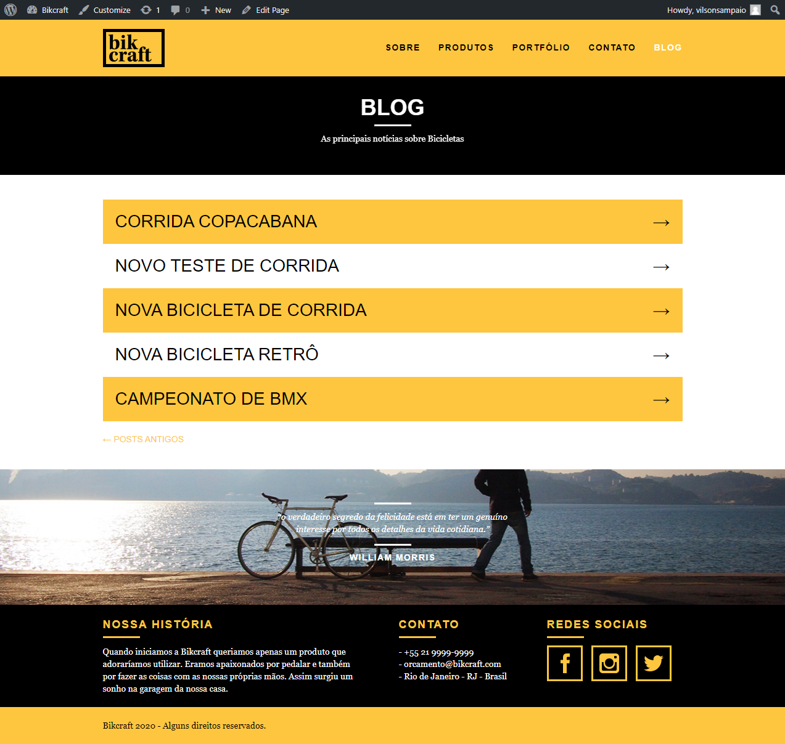
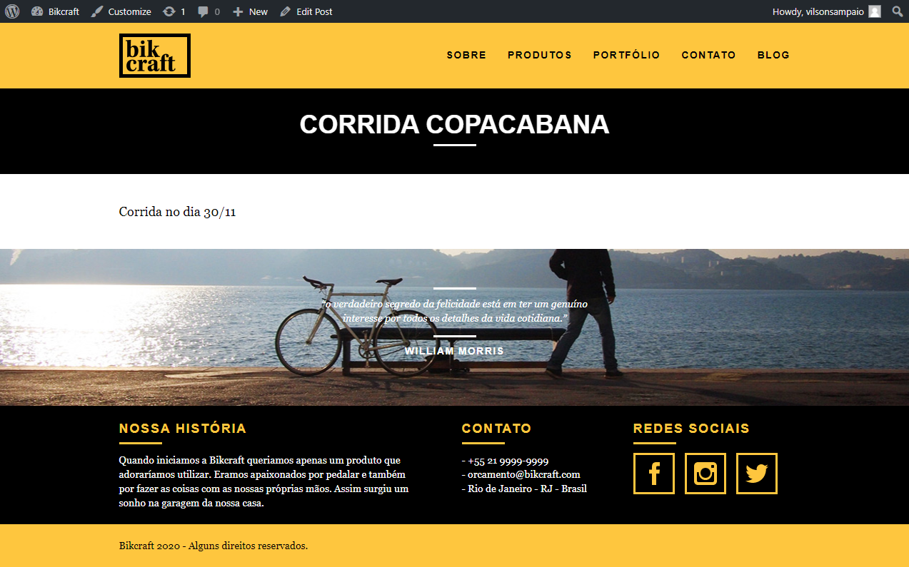

<h1 align="center">
    
    +
    
</h1>

  
   
  

  

  

  <a href="#-sobre-o-projeto">Sobre o projeto</a>&nbsp;&nbsp;&nbsp;|&nbsp;&nbsp;&nbsp;
  <a href="#-tecnologias">Tecnologias</a>&nbsp;&nbsp;&nbsp;|&nbsp;&nbsp;&nbsp;
  <a href="#-layout">Layout</a>&nbsp;&nbsp;&nbsp;|&nbsp;&nbsp;&nbsp;
  <a href="#-projeto-final">Projeto final</a>

 

  

## 💻 Sobre o projeto

A Bikcraft é uma empresa fictícia que trabalha com a personalização de bicicletas, cujo objetivo era o de aumentar seu faturamento por meio de um website, divulgando seus produtos para novos clientes.

## 🚀 Tecnologias

Esse projeto foi desenvolvido com as seguintes tecnologias:

- [WordPress](https://codex.wordpress.org/pt-br:P%C3%A1gina_Inicial)
- [PHP](https://www.php.net/manual/pt_BR/index.php)
- [HTML5](https://developer.mozilla.org/pt-BR/docs/Web/HTML)
- [CSS3](https://developer.mozilla.org/pt-BR/docs/Web/CSS)
- [JavaScript](https://developer.mozilla.org/pt-BR/docs/Web/JavaScript) (animações e slides)

## 🔖 Layout

O layout do site foi desenvolvido durante o curso de **WordPress Como CMS** da [Origamid](https://www.origamid.com/curso/wordpress-como-cms).

## 🌐 Projeto final
[Clique aqui](https://bikcraft.com) para acessar o projeto no ar!

### Home

### Sobre

### Produtos
#### Menu de produtos

#### Detalhes do produto

### Portfólio

### Contato

### Blog
#### Menu de Posts

#### Post

---

Feito com 💛 <a href="https://www.linkedin.com/in/vilsonsampaio/">Vilson Sampaio</a>

